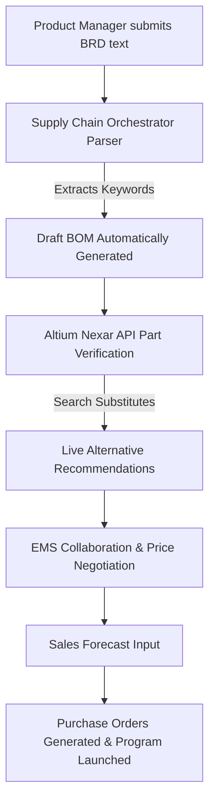

# 📦 Phoenix-PLM: AI-Native Product Lifecycle & Sourcing Platform

[](YOUR_TRACKABLE_GOOGLE_DRIVE_LINK_HERE)


> **Phoenix-PLM** is a high-fidelity prototype designed by a Technical Product Manager to validate end-to-end New Product Introduction (NPI), electronic part sourcing, and supply-chain operations workflows. 
> 
> By bridging **Design Engineering (PLM)** and **Sourcing Operations (MRP/ERP)**, Phoenix-PLM demonstrates how modern enterprise tools can dramatically shorten hardware launch lifecycles, identify part sourcing risks, and automate forecast-to-purchase orders.

---

## 🎯 The PMT "Prototyping" Context
In complex hardware ecosystems, requirement ambiguity between design engineers (who specify parts) and supply chain operations (who purchase them) often leads to costly launch delays and sourcing defects. 

I built **Phoenix-PLM** to:
1. **Stress-test the Altium Nexar GraphQL API** for real-time electronic component availability and component substitutes.
2. **Validate automated BRD-to-BOM translation workflows**, testing how NLP intent parsing can instantly draft technical Bill of Materials.
3. **Simulate supplier collaboration and manufacturing forecasts** to solicit early feedback from design, sourcing, and finance organizations.

---

## ⚙️ Core Sub-Systems & Features

Phoenix-PLM is organized as a unified monorepo containing two key operational sub-systems:

```
Phoenix-PLM/
├── npi-dashboard/               # React + Vite Design Engineering BOM Portal
├── supply-chain-orchestrator/   # Express Node.js & React Planning Engine
├── documents/                   # Real Product Requirements (Gemini Pin, Pixel Glasses)
└── README.md                    # Product & Technical Spec
```

### 1. NPI BOM & Sourcing Dashboard (`/npi-dashboard`)
An interactive portal tailored for Design Engineers and Component Quality PMs:
* **Altium Nexar API Integration**: Conducts live electronic component queries through Altium Nexar's GraphQL endpoint to evaluate part lifecycle status and technical specs.
* **Smart Substitute Engine**: Instantly flags single-source parts and recommends pin-compatible alternatives with real-time pricing and manufacturer details.
* **Component Risk Matrix**: Evaluates suppliers on quality ratings, supply chain risk levels (Low/Medium/High), and geographic sourcing locations.
* **Itemized Cost & Variant Analysis**: Models extended cost projections and manages SKU variant matrixes across regional, memory, color, and sales configurations.

### 2. Supply Chain Orchestrator (`/supply-chain-orchestrator`)
An operations-focused planning engine integrating Express (backend) and React (frontend):
* **BRD-to-BOM Parser**: Enables users to submit text-based Business Requirements Documents (BRDs). The engine parses text inputs for component keywords (e.g., semiconductor, display, memory) and auto-drafts a preliminary bill of materials.
* **EMS Supplier Negotiation Simulator**: Mimics electronic manufacturing collaboration, finalising the draft BOM and modeling inflation adjustment coefficients.
* **Forecast-to-PO Calculator**: Takes sales volume forecasts and translates them into exact purchase quantities and PO totals, transitioning program status to "In Production."

### 3. Integrated Product Specifications (`/documents`)
Includes functional requirements documents used to test the ingestion pipelines:
* `Gemini_Pin_BRD.docx`: A full-scale product requirement scope detailing hardware sensors, microfluidics, and battery life parameters for an AI pin accessory.
* `Pixel_Glasses_BRD.docx`: Technical product specifications detailing display, camera, and processor parameters for an augmented reality glass product.

---

## 🏗️ Interactive Product Flow



---

## 🚀 Quick Start (Local Setup)

### System Prerequisites
* **Node.js** (v16.0.0 or higher)
* **npm** (v7.0.0 or higher)

### Setup Sub-System 1: NPI Dashboard
1. Navigate to the dashboard directory:
   ```bash
   cd npi-dashboard
   ```
2. Copy the environment configuration:
   ```bash
   cp .env.example .env
   ```
3. Open `.env` and fill in your Altium Nexar API credentials (get your developer keys at [Nexar Developer Portal](https://www.nexar.com/)).
4. Install dependencies and run in development mode:
   ```bash
   npm install
   npm run dev
   ```

### Setup Sub-System 2: Supply Chain Orchestrator
1. Navigate to the backend server and start the API:
   ```bash
   cd supply-chain-orchestrator/server
   npm install
   npm start
   ```
2. Open a new terminal, navigate to the frontend client, and launch the user interface:
   ```bash
   cd supply-chain-orchestrator/client
   npm install
   npm start
   ```
3. Open `http://localhost:3000` to interact with the operational planning flow.

---

## 🎯 Future Product & Prototyping Roadmap
To drive further requirement validation, the next functional iterations include:
1. **Fine-Tuned LLM Ingestion**: Upgrade the basic keyword parser to a full Gemini-powered extraction agent to interpret unstructured PDF documents.
2. **Altium Nexar Real-time Webhooks**: Set up automated alerting when a selected production part undergoes an lifecycle change (EOL, Obsolescence) on the Nexar network.
3. **Multi-Scenario Sourcing Models**: Enable supply chain managers to simulate tariff impacts, regional lockdowns, and shipping delays across different BOM configurations.
